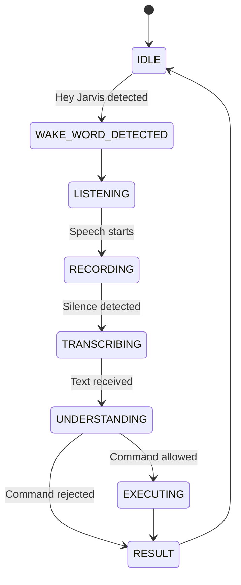
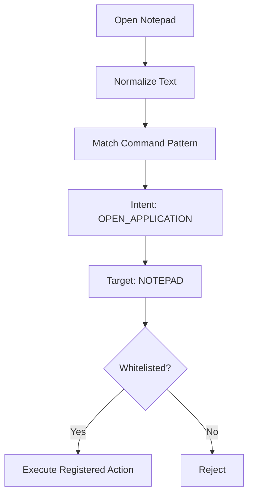
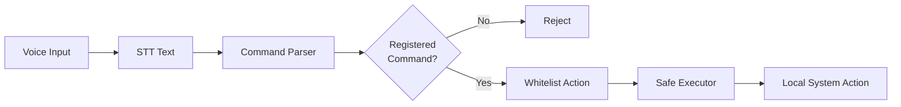

# Vocalis — Low-Latency Local Voice Assistant

**Vocalis V4** is a software-only, offline voice assistant that listens for a wake word, converts speech to text, understands predefined commands, and safely executes whitelisted actions on the local system.

No cloud APIs. No LLM required.

---

## How It Works

```mermaid
flowchart LR
    A[🎙️ Microphone<br/>16 kHz Mono] --> B[Audio Chunks<br/>512 samples / ~32 ms]

    B --> C[Silero VAD<br/>Speech Detection]

    C -->|Speech| D[OpenWakeWord<br/>"Hey Jarvis"]

    C -->|Silence| B

    D -->|Detected| E[Active Listening]

    E --> F[Record Command]

    F -->|Silence > 1s| G[faster-whisper<br/>Local STT]

    G --> H[Command Parser]

    H --> I{Whitelist<br/>Check}

    I -->|Allowed| J[Command Executor]

    I -->|Blocked| K[Reject Command]

    J --> L[System Action]
    K --> M[Display Result]
    L --> M
```

The pipeline is intentionally **cascaded**:

**VAD → Wake Word → STT → Command Parsing → Safe Execution**

This avoids running expensive speech recognition continuously when nobody is speaking.

---

## Signal Chain

```mermaid
flowchart LR
    A[Microphone] --> B[Capture<br/>16 kHz]
    B --> C[512 Samples<br/>32 ms]
    C --> D[Thread-Safe<br/>Queue]
    D --> E[Silero VAD]

    E -->|Speech| F[OpenWakeWord]
    F -->|"Hey Jarvis"| G[Listening Mode]

    G --> H[Audio Buffer]
    H --> I[Silence Detection]
    I --> J[faster-whisper]

    J --> K["Text<br/>Open Notepad"]
    K --> L[Command Parser]
    L --> M["Intent<br/>OPEN_APPLICATION"]
    M --> N["Target<br/>NOTEPAD"]
    N --> O[Whitelist]
    O --> P[Executor]
    P --> Q[Notepad Opens]
```



---

## State Machine



---

## Example

**User says:**

> Hey Jarvis

Vocalis detects the wake word and starts listening.

**User says:**

> Open Notepad

The system processes it as:

```text
Speech
   ↓
"Open Notepad"
   ↓
OPEN_APPLICATION
   ↓
NOTEPAD
   ↓
Whitelist Check
   ↓
notepad.exe
   ↓
Notepad Opens
```

---

## Command Understanding

Vocalis does not send raw speech directly to the operating system.

Instead, the command passes through a structured representation:



### Supported Actions

| Voice Command      | Intent             | Target        |
| ------------------ | ------------------ | ------------- |
| Open Notepad       | `OPEN_APPLICATION` | `NOTEPAD`     |
| Open Calculator    | `OPEN_APPLICATION` | `CALCULATOR`  |
| Open Paint         | `OPEN_APPLICATION` | `PAINT`       |
| Open File Explorer | `OPEN_APPLICATION` | `EXPLORER`    |
| Open Chrome        | `OPEN_APPLICATION` | `CHROME`      |
| Open VS Code       | `OPEN_APPLICATION` | `VSCODE`      |
| Open Downloads     | `OPEN_FOLDER`      | `DOWNLOADS`   |
| Open Desktop       | `OPEN_FOLDER`      | `DESKTOP`     |
| What time is it    | `GET_TIME`         | `SYSTEM_TIME` |
| What date is it    | `GET_DATE`         | `SYSTEM_DATE` |
| Exit Vocalis       | `EXIT_APPLICATION` | `VOCALIS`     |

---

## Security

The executor never accepts arbitrary shell commands.



### Design

* Commands are mapped to predefined actions.
* Arbitrary shell strings are not executed.
* `shell=True` is avoided.
* Suspicious commands are rejected.
* Missing applications are handled without crashing.
* Only registered actions can reach the executor.

---

## Models

| Component             | Model / Technology    | Purpose                |
| --------------------- | --------------------- | ---------------------- |
| VAD                   | **Silero VAD**        | Detect speech          |
| Wake Word             | **OpenWakeWord**      | Detect `"Hey Jarvis"`  |
| STT                   | **faster-whisper**    | Convert speech → text  |
| Command Understanding | **Rule-based parser** | Text → intent + target |

The command layer is intentionally rule-based. It keeps the system predictable and avoids adding an LLM where one is not necessary.

---

## Audio Processing

Vocalis processes audio continuously in small chunks:

```text
Microphone
    │
    ▼
16,000 samples / second
    │
    ▼
512 samples
    │
    ▼
~32 ms audio chunk
    │
    ▼
VAD → Wake Word → Recording
```

A thread-safe queue separates microphone capture from processing so the audio callback does not perform heavy inference work.

---

## What I Learned

### Audio & Speech

* Digital audio and sampling
* Audio chunks and buffering
* Voice Activity Detection
* Wake-word detection
* Speech-to-Text
* Silence-based speech segmentation

### Machine Learning

* Using pretrained models
* Model inference pipelines
* Confidence thresholds
* CPU inference
* Quantized inference with `int8`

### Software Engineering

* Modular Python architecture
* State machines
* Thread-safe queues
* Error handling
* Unit testing
* Separation of parsing and execution

### System Engineering

* Local/offline processing
* Latency measurement
* CPU and RAM monitoring
* Safe subprocess execution
* Whitelist-based command execution

---

## Project Structure

```text
Vocalis/
│
├── app.py
├── requirements.txt
├── README.md
│
├── tests/
│   ├── __init__.py
│   └── test_commands.py
│
└── vocalis/
    │
    ├── app.py
    │
    ├── audio/
    │   └── microphone.py
    │
    ├── vad/
    │   └── detector.py
    │
    ├── wakeword/
    │   └── detector.py
    │
    ├── stt/
    │   └── detector.py
    │
    ├── commands/
    │   ├── registry.py
    │   ├── parser.py
    │   └── executor.py
    │
    └── monitoring/
        └── metrics.py
```

---

## Key Libraries

```text
sounddevice
    └── Microphone audio capture

NumPy
    └── Audio array processing

PyTorch
    └── Model inference

Silero VAD
    └── Speech detection

OpenWakeWord
    └── Wake-word detection

faster-whisper
    └── Local speech-to-text

psutil
    └── CPU / RAM monitoring
```

---

## Performance

Runtime metrics are measured by Vocalis itself.

| Component                 | Typical Measurement |
| ------------------------- | ------------------: |
| VAD                       |         ~0.5–1.5 ms |
| Wake Word                 |           ~2–4.5 ms |
| STT                       |         ~200–420 ms |
| Command Parser            |             ~1–3 ms |
| Execution                 |           ~10–45 ms |
| Total Activation → Action |         ~500–700 ms |

Performance depends on the CPU, microphone, model configuration, and command length.

---

## Running

```bash
python app.py
```

Run tests:

```bash
python -m unittest discover tests
```

---

## Core Idea

```text
LISTEN
  ↓
DETECT
  ↓
UNDERSTAND
  ↓
VALIDATE
  ↓
EXECUTE
```

**Vocalis is built around one simple principle:**

> Process only what is necessary, keep it local, and never execute what has not been explicitly allowed.

---

## License

MIT License
