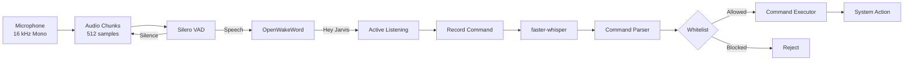
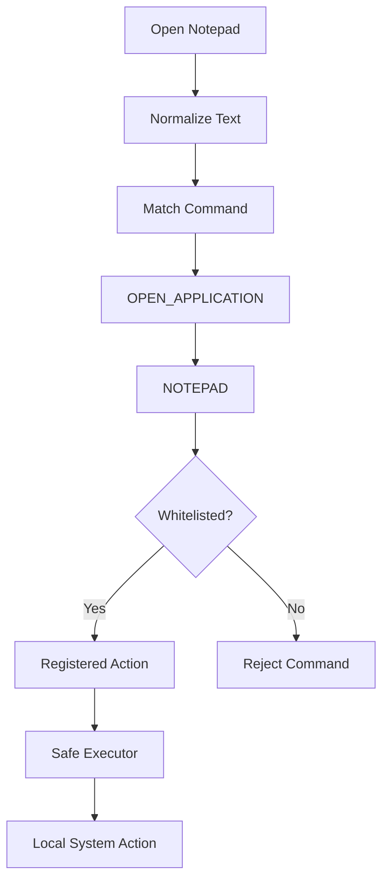

# Vocalis — Low-Latency Local Voice Assistant

Vocalis V4 is a **software-only, offline voice assistant** that detects a wake word, converts speech to text, understands predefined commands, and safely executes whitelisted actions on the local system.

**Python · Silero VAD · OpenWakeWord · faster-whisper · Offline**

---

## Overview

Vocalis processes voice through a lightweight cascade instead of running speech recognition continuously.



### Pipeline

**Microphone → VAD → Wake Word → Recording → STT → Command Parsing → Safe Execution**

The cascade reduces unnecessary processing by filtering silence before running the more expensive stages.

---

## What Vocalis Does

Example:

```text
User:
    "Hey Jarvis"

Vocalis:
    Wake word detected

User:
    "Open Notepad"

Vocalis:
    Speech → Text
          → Intent
          → Target
          → Whitelist check
          → Execute
```

Result:

```text
OPEN_APPLICATION
        ↓
     NOTEPAD
        ↓
   notepad.exe
        ↓
   Notepad Opens
```

---

## Command Processing & Security

Vocalis does **not** execute the raw text produced by STT.



### Security Design

* Only registered commands can be executed.
* Raw shell commands are never accepted.
* No arbitrary command execution.
* Dangerous inputs are rejected.
* Missing applications are handled gracefully.
* Command parsing and command execution are separate modules.

---

## Supported Commands

| Command            | Intent             | Target        |
| ------------------ | ------------------ | ------------- |
| Open Notepad       | `OPEN_APPLICATION` | `NOTEPAD`     |
| Open Calculator    | `OPEN_APPLICATION` | `CALCULATOR`  |
| Open Paint         | `OPEN_APPLICATION` | `PAINT`       |
| Open File Explorer | `OPEN_APPLICATION` | `EXPLORER`    |
| Open Chrome        | `OPEN_APPLICATION` | `CHROME`      |
| Open VS Code       | `OPEN_APPLICATION` | `VSCODE`      |
| Open Downloads     | `OPEN_FOLDER`      | `DOWNLOADS`   |
| Open Desktop       | `OPEN_FOLDER`      | `DESKTOP`     |
| What time is it    | `GET_TIME`         | `SYSTEM_TIME` |
| What date is it    | `GET_DATE`         | `SYSTEM_DATE` |
| Exit Vocalis       | `EXIT_APPLICATION` | `VOCALIS`     |

The command layer is **rule-based** rather than LLM-based, making the supported actions predictable and controlled.

---

## Models & Technologies

| Component                | Technology                        | Purpose                    |
| ------------------------ | --------------------------------- | -------------------------- |
| Voice Activity Detection | **Silero VAD**                    | Detect speech              |
| Wake Word                | **OpenWakeWord**                  | Detect `"Hey Jarvis"`      |
| Speech-to-Text           | **faster-whisper**                | Speech → text              |
| Command Understanding    | **Rule-based parser**             | Text → intent + target     |
| System Execution         | **Python subprocess/system APIs** | Execute registered actions |

Everything runs locally without cloud APIs.

---

## Audio Processing

Vocalis captures microphone audio at:

```text
Sample Rate : 16,000 Hz
Channels    : Mono
Data Type   : Float32
Chunk Size  : 512 samples
Chunk Time  : ~32 ms
```

The microphone callback places audio into a **thread-safe queue**. Processing happens separately so model inference does not block microphone capture.

---

## State Flow

```text
IDLE
  │
  │ Wake word
  ▼
WAKE_WORD_DETECTED
  │
  ▼
LISTENING
  │
  │ Speech
  ▼
RECORDING
  │
  │ Silence
  ▼
TRANSCRIBING
  │
  ▼
UNDERSTANDING
  │
  ▼
EXECUTING
  │
  ▼
RESULT
  │
  ▼
IDLE
```

---

## Project Structure

```text
Vocalis/
│
├── app.py
├── requirements.txt
├── README.md
├── tests/
│   └── test_commands.py
│
└── vocalis/
    ├── app.py
    │
    ├── audio/
    │   └── microphone.py
    │
    ├── vad/
    │   └── detector.py
    │
    ├── wakeword/
    │   └── detector.py
    │
    ├── stt/
    │   └── detector.py
    │
    ├── commands/
    │   ├── registry.py
    │   ├── parser.py
    │   └── executor.py
    │
    └── monitoring/
        └── metrics.py
```

### Module Responsibilities

* `microphone.py` — captures microphone audio
* `vad/detector.py` — speech detection
* `wakeword/detector.py` — wake-word detection
* `stt/detector.py` — local speech-to-text
* `commands/registry.py` — registered commands and aliases
* `commands/parser.py` — text normalization and intent matching
* `commands/executor.py` — safe action execution
* `monitoring/metrics.py` — latency, CPU and RAM metrics
* `app.py` — application flow and state management

---

## Performance

Measured runtime values from the current implementation:

| Stage               | Typical Latency |
| ------------------- | --------------: |
| VAD                 |     ~0.5–1.5 ms |
| Wake Word           |       ~2–4.5 ms |
| STT                 |     ~200–420 ms |
| Command Parsing     |         ~1–3 ms |
| Execution           |       ~10–45 ms |
| Activation → Action |     ~500–700 ms |

Actual performance depends on hardware, model configuration, and command length.

---

## Run

```bash
python app.py
```

Run tests:

```bash
python -m unittest discover tests
```

---

## What I Learned

**Audio**

* Sampling and digital audio
* Audio chunking and buffering
* Voice Activity Detection
* Wake-word detection
* Speech segmentation

**ML / AI**

* Pretrained model inference
* Confidence thresholds
* Local speech recognition
* Quantized CPU inference

**Engineering**

* Thread-safe processing
* State machines
* Modular architecture
* Command parsing
* Secure subprocess execution
* Unit testing
* Latency and resource monitoring

---

## Core Principle

> **Listen only when necessary, understand locally, and execute only what has been explicitly allowed.**

---

## License

MIT
